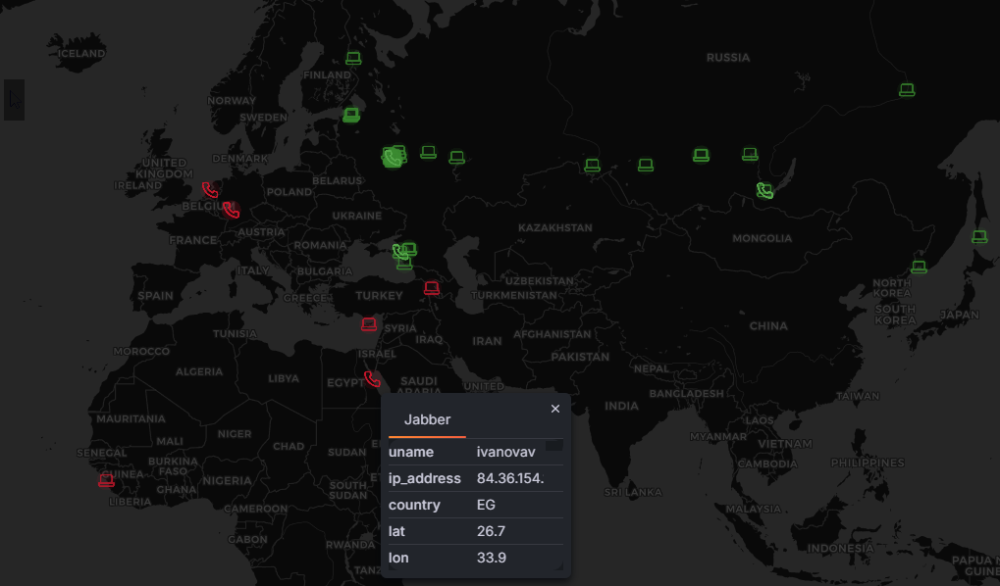
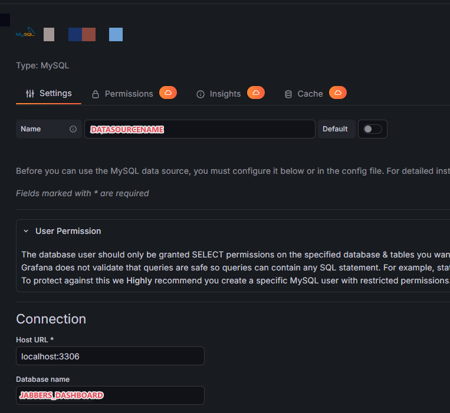
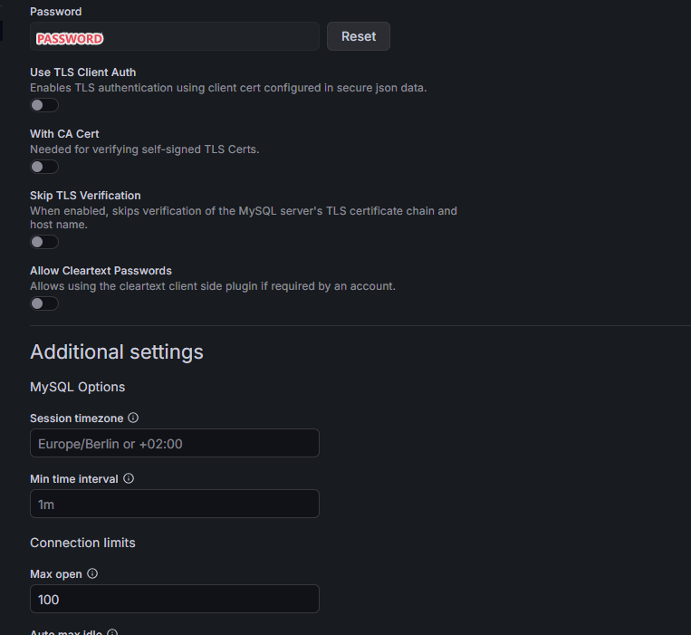
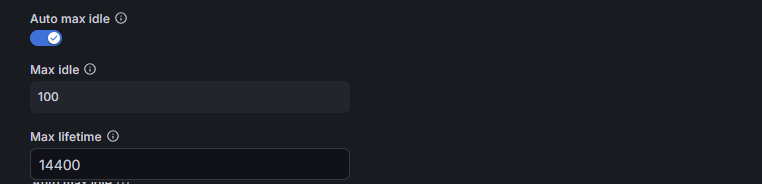
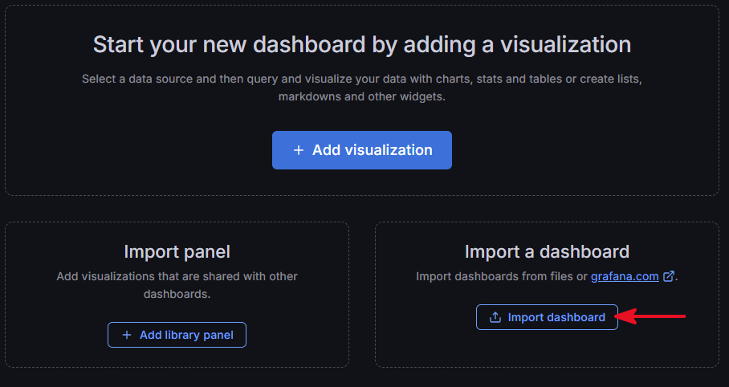
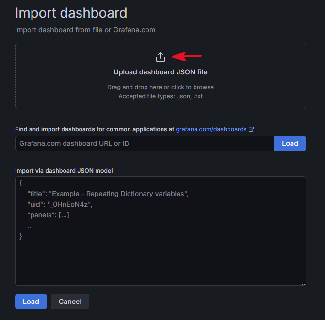

### GeoIP Dashboard in Grafana using Cisco Expressway logs (12.5.6)
Python 3.6.8 — tested version.



---

## How it works

1. The Python script (`gju-local.py`) parses the Cisco Expressway syslog file and extracts the following information:

   * User login
   * Client IP address
   * Connection time

2. The script uses the extracted IP address to perform a lookup in the local GeoIP2 database and retrieves:

   * Country
   * City
   * Region
   * ASN number
   * ASN name
   * Latitude
   * Longitude
   * Time zone

3. The script stores the collected data in a local MySQL database. The `JABBER` table is then used as a data source by Grafana to display the client locations on a map.

---

## MySQL Database Setup

Create the database and user:

```sql
sudo mysql -u my_sql_admin_user -p

CREATE DATABASE JABBERS_DASHBOARD;

CREATE USER 'MYSQLUSER'@'localhost' IDENTIFIED BY 'PASSWORD';

GRANT ALL PRIVILEGES ON JABBERS_DASHBOARD.* TO 'MYSQLUSER'@'localhost';

FLUSH PRIVILEGES;

CREATE TABLE IF NOT EXISTS JABBER (
    id INT NOT NULL,
    lname VARCHAR(128) NOT NULL,
    ip_address VARCHAR(16) NOT NULL,
    conn_time VARCHAR(32) NOT NULL,
    asn_number VARCHAR(128) NOT NULL,
    asn_name VARCHAR(128) NOT NULL,
    country VARCHAR(64) NOT NULL,
    region VARCHAR(128) NOT NULL,
    city VARCHAR(128) NOT NULL,
    latitude DECIMAL(8,6) NOT NULL,
    longitude DECIMAL(9,6) NOT NULL,
    timezone VARCHAR(64) NOT NULL,
    txn_id INT NOT NULL UNIQUE,
    response_code VARCHAR(64) NOT NULL,
    PRIMARY KEY(id)
);

EXIT;
```

---

## Grafana (12.4.4)

1. Create a Grafana datasource pointing to your MySQL database, or use an existing MySQL datasource.







2. Import the dashboard from `grafana_panel.json`, or configure the visualization manually using the MySQL datasource and the **Geomap** visualization.





---
